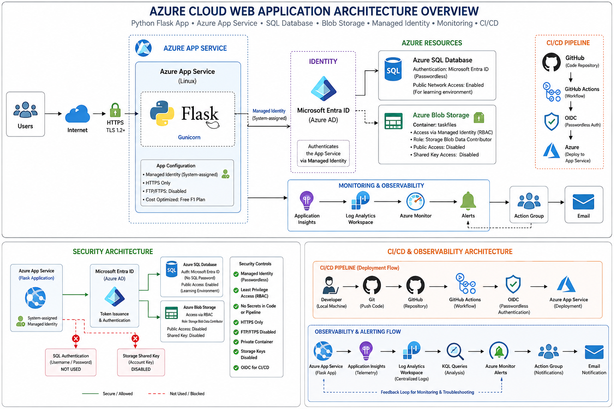
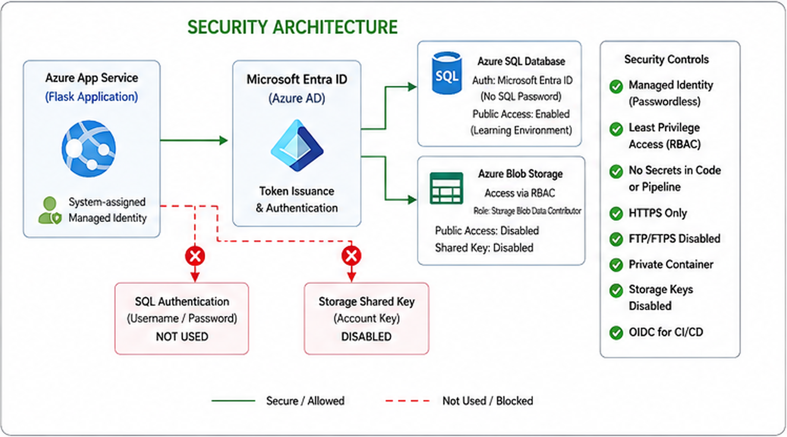
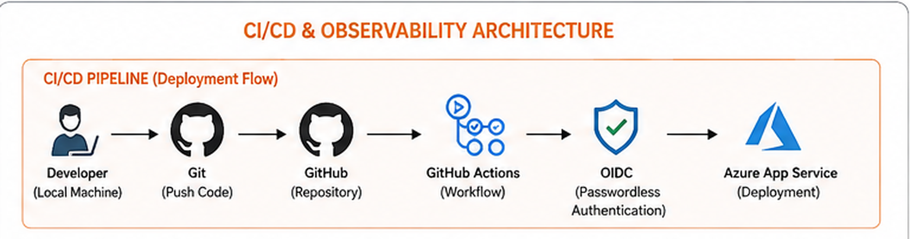
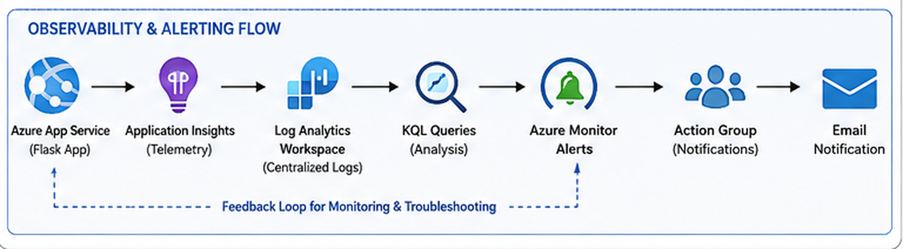

\# Azure Cloud Web Application


A cloud-native Python Flask web application deployed on Microsoft Azure,

demonstrating CI/CD, passwordless authentication, cloud data services,

monitoring, security, and cost-aware architecture.


\## Architecture Overview





\## Project Overview


This project demonstrates the design, deployment, security, and monitoring

of a Python Flask web application on Microsoft Azure.


The application allows users to create, update, complete, and delete cloud

tasks. Each task can also include a file attachment stored securely in

Azure Blob Storage.


The application runs on Azure App Service and uses Azure SQL Database for

structured application data and Azure Blob Storage for file storage.


A key goal of the project was to avoid storing credentials in application

code. Azure Managed Identity and Microsoft Entra ID are therefore used for

passwordless access to Azure services.


The project also implements automated deployment through GitHub Actions,

application monitoring with Application Insights, log analysis using KQL,

and proactive alerting through Azure Monitor.


\## Application Features


\- Create, read, update, and delete cloud tasks (CRUD)

\- Attach files to individual tasks

\- Store structured task data in Azure SQL Database

\- Store attachments in a private Azure Blob Storage container

\- Securely download private files through the application

\- Passwordless access to Azure services using Managed Identity

\- Automated CI/CD deployment using GitHub Actions

\- OIDC-based authentication between GitHub and Azure

\- Application telemetry with Application Insights

\- Log analysis and troubleshooting using KQL

\- Azure Monitor alerts with email notifications


\## Azure Architecture \& Services


The solution is built using multiple Azure services, with each service

responsible for a specific part of the application architecture.


| Azure Service | Purpose |

|---|---|

| Azure App Service | Hosts the Python Flask web application on Linux |

| App Service Plan | Provides the compute resources for the web application |

| Azure SQL Database | Stores structured task data |

| Azure Blob Storage | Stores task file attachments |

| Microsoft Entra ID | Provides identity-based authentication |

| Managed Identity | Enables passwordless access from the application to Azure resources |

| Azure RBAC | Controls access to Blob Storage using least-privilege permissions |

| Application Insights | Collects application telemetry, requests, failures, and performance data |

| Log Analytics Workspace | Centralizes logs and enables KQL-based analysis |

| Azure Monitor | Evaluates monitoring conditions and triggers alerts |

| Action Group | Sends email notifications when an alert is triggered |

| GitHub Actions | Automates application build and deployment |


\### Application Data Flow


1\. A user accesses the Flask application over HTTPS.

2\. Azure App Service runs the application.

3\. The application uses Managed Identity to authenticate to Azure services.

4\. Task data is stored in Azure SQL Database.

5\. File attachments are stored in a private Azure Blob Storage container.

6\. Application telemetry is collected by Application Insights.

7\. Logs can be analyzed using KQL through Log Analytics.

8\. Azure Monitor evaluates alert conditions and uses an Action Group to send notifications.


## Security Architecture




Security was designed around identity-based access and the principle of

least privilege rather than storing credentials inside the application.


\### Security Controls


\- \*\*Managed Identity:\*\* The Azure App Service uses a managed identity to

&#x20; authenticate to Azure data services without storing passwords or secrets

&#x20; in the application code.


\- \*\*Azure SQL Authentication:\*\* Access to Azure SQL Database is performed

&#x20; using Microsoft Entra ID authentication rather than a SQL username and

&#x20; password stored in the application.


\- \*\*Azure Blob Storage RBAC:\*\* The application accesses Blob Storage through

&#x20; Azure RBAC using the `Storage Blob Data Contributor` role.


\- \*\*Private Blob Container:\*\* The `taskfiles` container does not allow

&#x20; anonymous public access.


\- \*\*Storage Shared Key Disabled:\*\* Shared Key authorization was disabled

&#x20; after verifying that the application successfully accesses Blob Storage

&#x20; using Managed Identity.


\- \*\*HTTPS Only:\*\* The App Service accepts application traffic over HTTPS.


\- \*\*FTP Disabled:\*\* FTP/FTPS access was disabled because deployments are

&#x20; performed through GitHub Actions.


\- \*\*OIDC for CI/CD:\*\* GitHub Actions authenticates to Azure using OpenID

&#x20; Connect (OIDC), avoiding long-lived Azure deployment credentials stored

&#x20; in GitHub.


\### Passwordless Data Access


The application follows this authentication model:


App Service → Managed Identity → Microsoft Entra ID / Azure RBAC → Azure Resources


This removes the need to store Azure SQL passwords or Storage Account keys

inside the application or source repository.


\### Current Security Limitation


For this learning environment, Azure SQL currently allows public network

connectivity so that the application can reach the database without a

private networking architecture.


A production implementation would use App Service VNet Integration,

Private Endpoints, and Private DNS for Azure SQL and Storage, with public

network access disabled.


\## CI/CD Pipeline




Application deployment is automated using GitHub Actions.


Changes pushed to the `main` branch automatically trigger the deployment

workflow, which authenticates to Microsoft Azure using OpenID Connect (OIDC)

and deploys the latest version of the Flask application to Azure App Service.


\### Deployment Flow


1\. Application code is developed and tested locally.

2\. Changes are committed using Git.

3\. The code is pushed to the `main` branch on GitHub.

4\. GitHub Actions automatically starts the deployment workflow.

5\. The workflow authenticates to Azure using OIDC.

6\. Application dependencies are installed and the application is prepared for deployment.

7\. The new application version is deployed to Azure App Service.

8\. The updated application becomes available through the App Service HTTPS endpoint.


\### CI/CD Flow


Developer → Git → GitHub → GitHub Actions → OIDC → Azure App Service


This approach eliminates manual application deployment and avoids storing

long-lived Azure credentials in the GitHub repository.


## Monitoring & Observability




Application monitoring and observability are implemented using Azure

Application Insights, Log Analytics, and Azure Monitor.


Application Insights collects telemetry from the Flask application,

including HTTP requests, response times, failed requests, and exceptions.


\### Monitoring Capabilities


\- HTTP request and response monitoring

\- Application failure and exception tracking

\- Response-time and performance analysis

\- KQL-based log investigation

\- Azure Monitor alert rules

\- Action Group email notifications

\- Failure anomaly detection


### KQL Analysis

Kusto Query Language (KQL) was used to investigate application behavior
and troubleshoot failures.

Example query used to analyze request performance:

```kusto
requests
| summarize
    Requests=count(),
    AverageDuration=avg(duration),
    MaximumDuration=max(duration),
    P95=percentile(duration, 95)
    by name
| order by P95 desc
```

Failed requests were investigated using:

```kusto
requests
| where success == false
| project timestamp, name, resultCode, duration, url
| order by timestamp desc
```

Application exceptions were analyzed using:

```kusto
exceptions
| project timestamp, type, outerMessage, innermostMessage, operation_Name
| order by timestamp desc
```


\## Incident Troubleshooting


Monitoring was tested using real failure scenarios rather than only

verifying that telemetry was being collected.


\### Incident 1 — Missing Blob Attachment


A file associated with an existing task was manually removed from the

private Blob Storage container and then requested through the application.


Application Insights detected an HTTP 500 failure on the download endpoint.


Root cause:


\- The SQL record still referenced the attachment.

\- The corresponding Blob object no longer existed.

\- The unhandled Blob Storage exception resulted in HTTP 500.


Resolution:


The Flask application was updated to handle `ResourceNotFoundError`

and return an appropriate HTTP 404 response when the Blob no longer exists.


This changed an unhandled server failure into an expected application response.


\### Incident 2 — Azure SQL Login Timeout


Application Insights identified two HTTP 500 responses on the main

application endpoint with response times of approximately 15–17 seconds.


KQL investigation revealed the following database connectivity exception:


`pyodbc.OperationalError: Login timeout expired`


The application was subsequently tested again and returned HTTP 200

responses with normal response times, indicating a transient database

connectivity or serverless availability event rather than a persistent

application failure.


This incident demonstrated how Application Insights and KQL can be used

to correlate slow requests with backend exceptions and identify the

probable failure layer.


\### Alert Validation


An Azure Monitor alert was configured to detect multiple failed requests

within a short evaluation window.


The alert was intentionally triggered by generating failed HTTP requests.


The complete alerting path was successfully validated:


Failed Request → Application Insights → Azure Monitor Alert →

Action Group → Email Notification


The alert entered the `Fired` state and the configured email notification

was successfully received.


\## Cost Optimization


The project was designed as a low-cost learning environment while still

using real Azure services.


\### Cost-Aware Design Decisions


\- Azure App Service uses the Free F1 tier.

\- Azure SQL Database uses the Azure SQL free offer with serverless compute.

\- SQL overage billing was disabled to prevent unexpected charges after

&#x20; the free monthly allowance is exhausted.

\- Azure Blob Storage is used only for small application attachments.

\- Application Insights and Log Analytics usage is kept minimal for the

&#x20; portfolio workload.

\- Resources are grouped inside a dedicated resource group to simplify

&#x20; cost tracking and lifecycle management.


Azure Cost Management can be used to monitor spending as the environment

or workload grows.


\## Governance \& Resource Tagging


Azure resource tags were applied to improve organization, governance,

ownership visibility, and future cost analysis.


| Tag | Value |

|---|---|

| Project | AzureWebAppPortfolio |

| Environment | Dev |

| ManagedBy | Abdulsattar |

| Purpose | Learning |

| CostCenter | Portfolio |


These tags make it easier to identify resources by project, environment,

purpose, ownership, and cost category.


In a larger Azure environment, tagging standards could be enforced

automatically using Azure Policy.


> Note: Applying tags to the Free F1 App Service Plan through the Azure

> Portal resulted in a worker-size/SKU conflict. The pricing tier was left

> unchanged to avoid modifying the environment solely for tagging.


\## Production Improvements


The current architecture is intentionally optimized for learning and

low-cost portfolio usage. A production implementation would introduce

additional security, availability, and operational controls.


Potential improvements include:


\- Integrate Azure App Service with an Azure Virtual Network.

\- Use Private Endpoints for Azure SQL Database and Azure Storage.

\- Disable public network access to backend data services.

\- Configure Azure Private DNS for private service resolution.

\- Upgrade the App Service Plan to a production tier with SLA and scaling.

\- Configure autoscaling where appropriate.

\- Separate development, staging, and production environments.

\- Add deployment approvals and environment protection to the CI/CD pipeline.

\- Store application configuration centrally using Azure App Configuration

&#x20; where appropriate.

\- Use Azure Key Vault for secrets required by future external services.

\- Implement backup, recovery, and disaster-recovery requirements.

\- Define infrastructure using Infrastructure as Code (IaC), such as Bicep

&#x20; or Terraform.

\- Enforce governance requirements using Azure Policy.


\## Technologies Used


\### Cloud

\- Microsoft Azure

\- Azure App Service

\- Azure SQL Database

\- Azure Blob Storage

\- Microsoft Entra ID

\- Azure Managed Identity

\- Azure RBAC

\- Application Insights

\- Log Analytics

\- Azure Monitor


\### DevOps

\- Git

\- GitHub

\- GitHub Actions

\- OpenID Connect (OIDC)

\- CI/CD


\### Application

\- Python

\- Flask

\- Gunicorn

\- pyodbc

\- Azure Identity SDK

\- Azure Storage Blob SDK


\### Monitoring \& Operations

\- Kusto Query Language (KQL)

\- Azure Monitor Alerts

\- Action Groups


\## Lessons Learned


This project provided hands-on experience designing and operating an

Azure-hosted application rather than only provisioning individual cloud

resources.


Key learning outcomes included:


\- Designing a multi-service Azure application architecture

\- Deploying Python applications to Azure App Service

\- Building an automated GitHub Actions CI/CD pipeline

\- Using OIDC for secure GitHub-to-Azure authentication

\- Implementing passwordless service-to-service authentication

\- Applying Managed Identity and Azure RBAC

\- Integrating Azure SQL Database and private Blob Storage

\- Applying least-privilege security principles

\- Monitoring application health and performance

\- Writing KQL queries for troubleshooting

\- Investigating real HTTP 500 errors and SQL connectivity failures

\- Creating and validating proactive Azure Monitor alerts

\- Applying Azure resource tagging and basic governance practices

\- Evaluating cloud cost and production-readiness trade-offs

